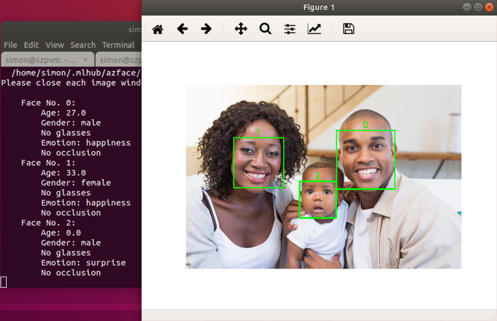
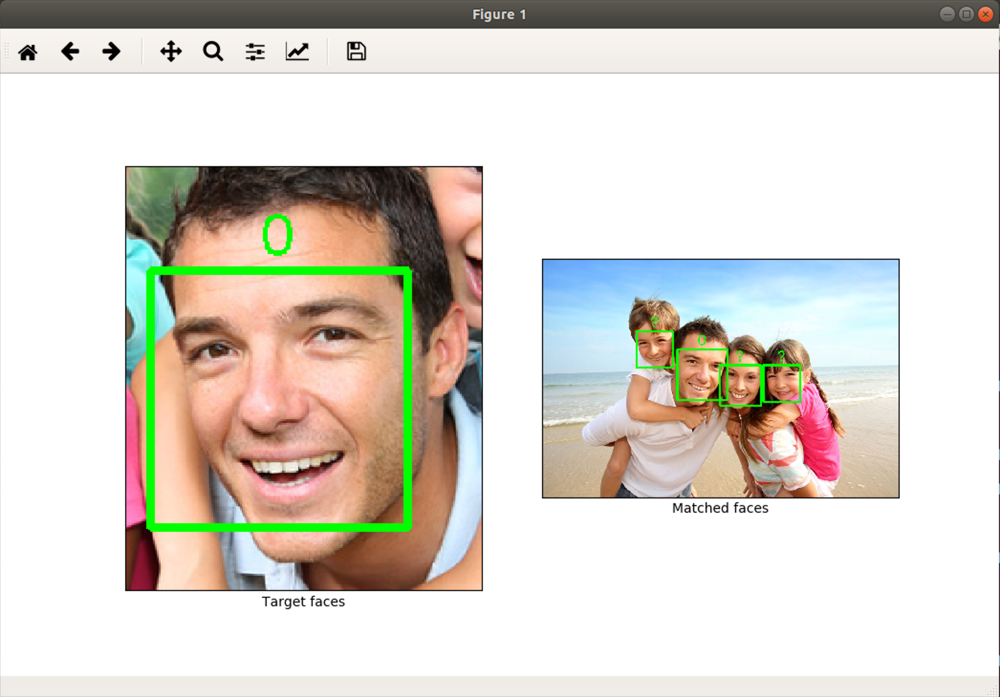

# MLHub package *azface* - Face Detection and Recognition #

**azface** is a [MLHub](https://mlhub.ai) package that provides a
quick introduction of the [Face
API](https://azure.microsoft.com/en-us/services/cognitive-services/face/)
of [Microsoft Azure](https://azure.microsoft.com/en-us/)'s [Cognitive
Services](https://azure.microsoft.com/en-us/services/cognitive-services/).

**NOTE**: The face detection and recognition tasks in **azface** are
carried out via the Face Python SDK
([**azure-cognitiveservices-vision-face**](https://pypi.org/project/azure-cognitiveservices-vision-face/)).
To use **azface**, Azure face service should be subscribed and a
7-days free subscription account can be obtained at [Try Cognitive
Services](https://azure.microsoft.com/en-us/try/cognitive-services/?api=face-api).
In addition, MLHub is a command line tool mainly targeted on Ubuntu,
so a Ubuntu machine is needed as well.


## Installation ##

```console
$ pip3 install mlhub             # Install MLHub
$ ml install simonzhaoms/azface  # Install azface
$ ml configure azface            # Configue azface, install required dependencies
```


## Face Detection ##

The face detection feature can find all faces in a photo and tell the
gender, age, emotion of the persons:

```console
$ ml detect azface --key-file key.txt --photo '~/.mlhub/azface/photo/detection'
```




## Face recognition ##

Face recognition can find similar faces between two photos.

```console
$ ml similar azface --target '~/.mlhub/azface/photo/PersonGroup/Family1-Dad-Bill/Family1-Dad1.jpg' --candidate '~/.mlhub/azface/photo/identification/identification1.jpg'
$ ml similar azface --target '~/.mlhub/azface/photo/identification/identification1.jpg' --candidate '~/.mlhub/azface/photo/PersonGroup/Family1-Dad-Bill/'
  ```


